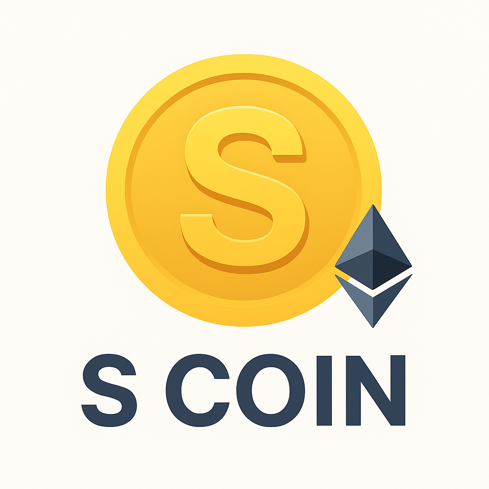

# 💰 S Coin — Mini Web3 App
## Develop By Shiboshree Roy

A premium **Web3 wallet dashboard** and **daily ERC20 reward platform** built with **Ruby on Rails 7**, **TailwindCSS**, and **Ethers.js**.
Users can **connect MetaMask**, view **ETH & token balances**, and **claim daily ERC20 rewards** securely with a beautiful, glassmorphic UI.

---

## 🚀 Version

**v1.0.0** — *Stable Release*

---

---

## ✨ Features

* 🔗 **Connect MetaMask** in seconds.
* 💸 View **real-time ETH & S Coin (ERC20)** balances.
* 🎁 **Claim daily ERC20 rewards** securely.
* ⏳ **Countdown timer** for next reward eligibility.
* 🔒 **MetaMask signature verification** for secure transactions.
* 👤 **User authentication** via Devise.
* 🪞 **Modern glassmorphic UI** with TailwindCSS gradients.
* 📱 **Fully responsive** on all devices.
* ⚙️ **Professional navbar & footer** with social links.

---

## 🧠 Tech Stack

| Layer        | Technology                     |
| :----------- | :----------------------------- |
| **Backend**  | Ruby on Rails 7                |
| **Frontend** | HTML5, TailwindCSS, JavaScript |
| **Web3**     | Ethers.js v6                   |
| **Auth**     | Devise                         |
| **Database** | PostgreSQL / MySQL             |
| **Token**    | Custom ERC20 – S Coin          |

---

## 🛠️ Installation

### 1️⃣ Clone the repository

```bash
git clone https://github.com/shiboshreeroy/s_coin.git
cd s_coin
```

### 2️⃣ Install dependencies

```bash
bundle install
yarn install
```

### 3️⃣ Database setup

```bash
rails db:create
rails db:migrate
rails db:seed
```

### 4️⃣ Start Rails server

```bash
rails server
```

### 5️⃣ Access the app

```
http://localhost:3000
```

---

## 💡 Usage Guide

1. 🧾 **Sign up / Log in** with Devise authentication.
2. 🔗 Click **“Connect MetaMask”** to link your wallet.
3. 💰 View your **ETH & S Coin** balances.
4. 🎉 Claim your **daily reward** (once per 24 hours).
5. 🌈 Enjoy a **modern, premium Web3 dashboard**.

---

## 📂 Project Structure

```
app/
├── controllers/      # Application controllers
├── models/           # User, Wallet, and Reward models
├── views/            # TailwindCSS-based UI
├── javascript/       # Ethers.js scripts and wallet logic
config/
├── routes.rb         # Routes configuration
db/
├── migrate/          # Database migrations
```

---

## 🤝 Contributing

Contributions are always welcome!
To contribute:

1. Fork this repository
2. Create your feature branch (`git checkout -b feature/awesome-feature`)
3. Commit changes (`git commit -m 'Add new feature'`)
4. Push to the branch (`git push origin feature/awesome-feature`)
5. Submit a Pull Request

---

## 📜 License

Licensed under the **MIT License** — free for personal and commercial use.
See [`LICENSE`](LICENSE) for more details.

---

## 🖼️ Screenshots

| Wallet Dashboard                                    | Claim Reward                                       |
| --------------------------------------------------- | -------------------------------------------------- |
|  |  |

---

## 📬 Contact

* **Project:** S Coin
* **GitHub:** [github.com/shiboshreeroy/s_coin](https://github.com/shiboshreeroy/s_coin)
* **Twitter:** [@s_coin](https://twitter.com/s_coin)
* **Author:** [Shiboshree Roy](https://github.com/shiboshreeroy)

---

## 🪙 About

> **S Coin** — Empowering the next generation of the digital economy, one wallet at a time.

---

## 🏷️ Badges


